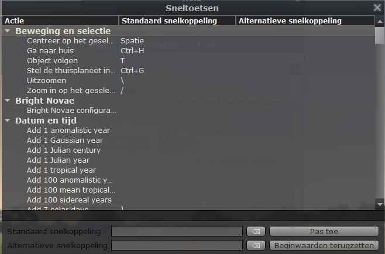
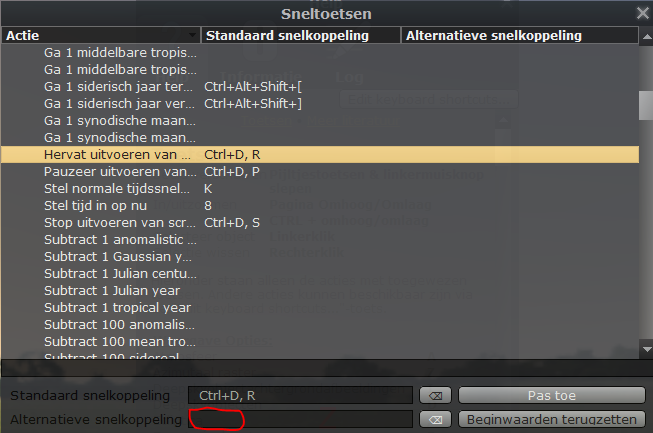
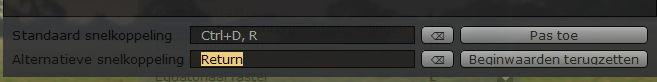
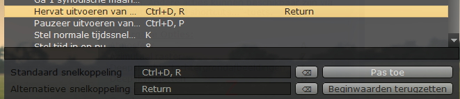

.. contents ::

Inleiding
---------

In het script wordt veelvuldig gebruik gemaakt van het commando “core.pause”. Om het pauzeren te beëindigen, moet default volgende toetsencombinatie gebruikt worden: CTRL + D, gevolgd door R.

Met onderstaande procedure wordt de ENTER (of RETURN) toets als alternatief toegevoegd.
Wil je met een powerpoint presenter werken, dan moet je de toets PgDown voorzien i.p.v. ENTER.

.. warning:: Opgelet! Hiermee ontregelt je bepaalde functies van Stellarium, zoals de zoekfunctie (F3 of Ctrl-F)

Procedure
---------

Start Stellarium op. Met de functietoets `F1` krijg je ondestaand Help-venster te zien.

Klik op de “Edit keyboard shortcuts” knop.

*OPGELET*: Afhankelijk van de versie kan deze knop ook onderaan het Help-venster staan

Je krijgt dan volgend venster.

Blader verder tot je de lijn “Hervat uitvoeren van ...” te zien krijgt.
Selecteer deze lijn.

Plaats de cursor in het hierboven met een rode cirkel aangeduide vak.
Druk op de ENTER (RETURN) toets. Het woordje Return verschijnt dan in het vak van de “Alternatieve snelkoppeling”.

*Opmerking*: Druk je op een verkeerde toets, of druk je per ongeluk tweemaal op de ENTER toets, dan kan je dat nog altijd terugzetten met de “undo” knop, net achter het in te vullen vakje.

Vergeet niet op de knop “Pas toe” te drukken om de wijziging op te slaan.
Je krijgt dan uiteindelijk dit:

